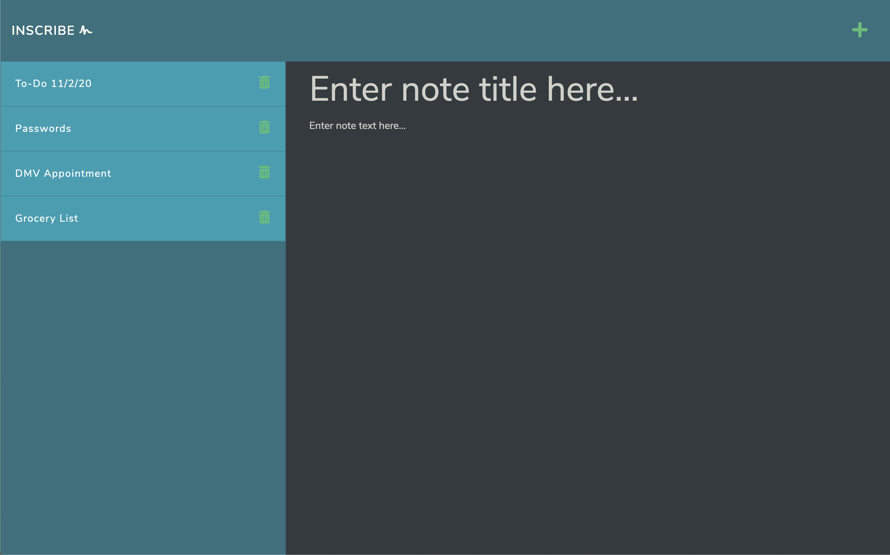
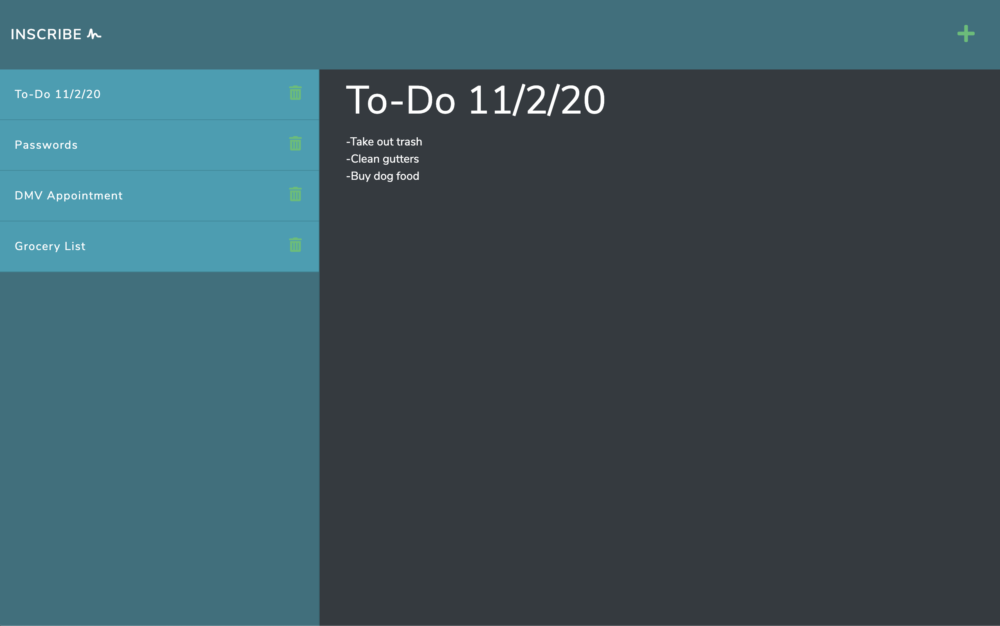

# Inscribe Note Taker 
With the Inscribe Note Taker, users are able to save, retrieve, and delete persistent notes at their convenience.  This is made possible by Node.js, Express, and server-side functionality.

<a href="https://inscribe-notes.herokuapp.com/" target="_blank">Demo the deployed app here</a>

## User Story
AS A user, I want to be able to write and save notes <br>
I WANT to be able to delete notes I've written before <br>
SO THAT I can organize my thoughts and keep track of tasks I need to complete


## Table of Contents
* [Installation](#installation)
* [Usage](#usage)
* [Resources](#resources)
* [Contributions](#contributions)
* [Testing](#testing)
* [Questions](#questions)
* [License](#license)


## Installation
If you want to use the application on your local server:
1. Clone the repo.
2. Install required dependencies by running command ```npm i```.
3. Run command ```node server``` to start the server on your local machine.

Otherwise, feel free to demo the deployed application <a href="https://inscribe-notes.herokuapp.com/" target="_blank">here</a>.

## Usage
To use Inscribe, simply click in the text area labeled "Enter note title here..." and insert the title of your note.  Repeat the same process for the note text.  After the note text is inserted, a save button will appear in the top right corner.  Click the button to save the note to your list of notes in the sidebar.  To retrieve the note, simply click on the note in the sidebar.  To delete the note, click on the trash can icon next to the note in the sidebar. When viewing a note, click the "add" icon in the top right corner to add a new note to your list.





## Resources
**jQuery** <br>
**Node.js** <br>
**Express** <br>
**Bootstrap** <br>
**UUID** <br>
**Heroku** <br>
**Font Awesome**


## Contributions
All contributions to this project are welcome!  Clone the repo down to your local machine, commit changes, push to GitHub, and open a pull request!

## Testing
No tests are set up for Inscribe at this time.  Feel free to write tests or search the application for bugs.  

## Questions
If you have any further questions, feel free to reach out to me! <br>
<a href='https://www.github.com/twkirkpatrick' target="_blank">Github</a> <br>
<a href='mailto:twk4491@gmail.com' target="_blank">twk4491@gmail.com</a>

## License
Usage is provided under the MIT license.
